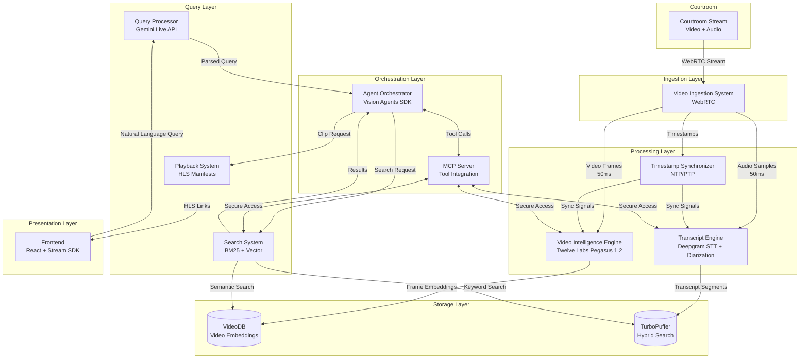
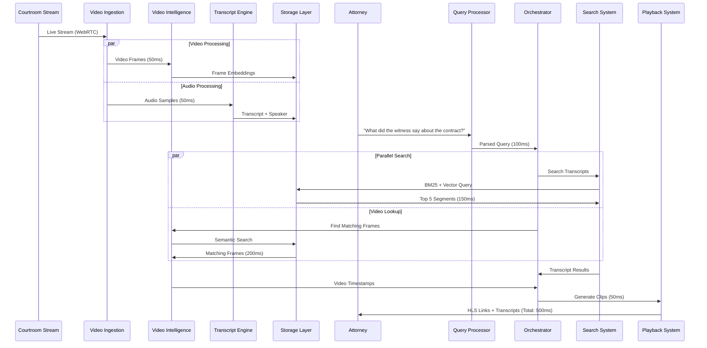
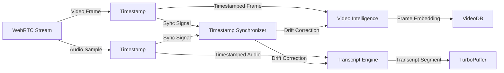
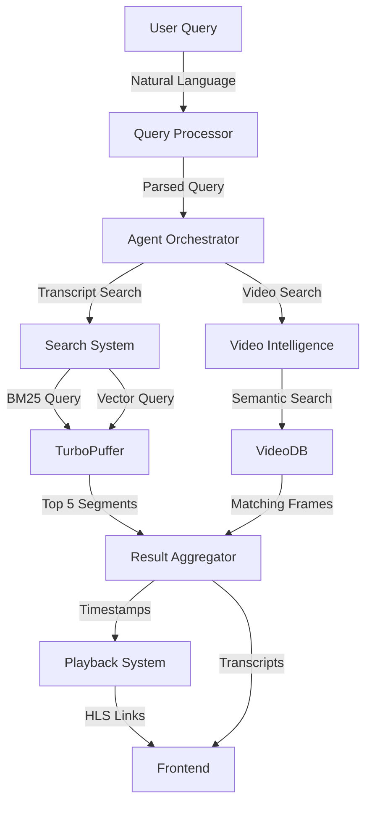
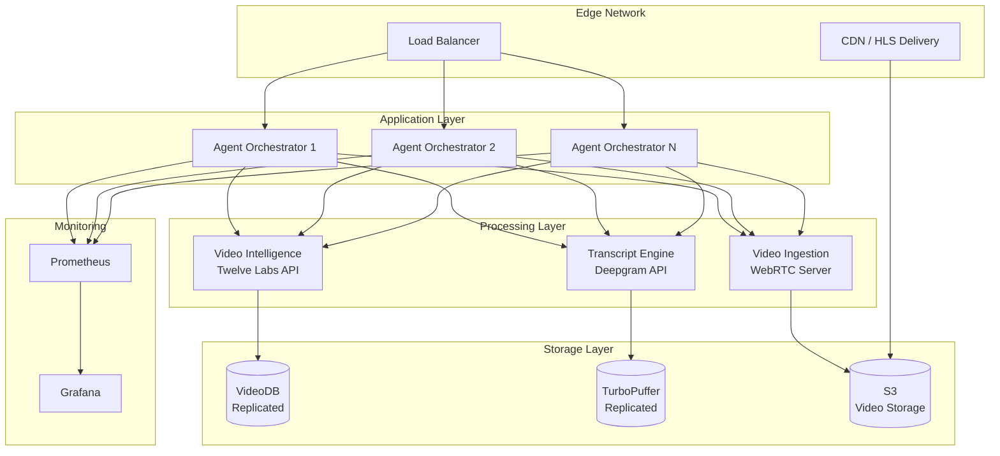

# Design Document: Courtroom Video Analyzer Agent

## Overview

The Courtroom Video Analyzer Agent is a real-time multimodal AI system that enables attorneys to query live courtroom proceedings using natural language during active trials. The system achieves sub-500ms query response latency by combining WebRTC video ingestion, Twelve Labs Pegasus 1.2 for video understanding, Deepgram for real-time transcription with speaker diarization, TurboPuffer for hybrid search, and Gemini Live API for natural language processing.

### Key Design Goals

1. **Ultra-Low Latency**: Achieve sub-500ms end-to-end query response time through edge processing and parallel component execution
2. **Multimodal Understanding**: Combine visual and audio analysis to enable queries about what was said, who said it, and what was shown
3. **Legal Precision**: Use hybrid search (BM25 + vector) to balance exact legal terminology matching with semantic understanding
4. **Real-Time Processing**: Continuously ingest, index, and make searchable live courtroom streams without buffering delays
5. **Temporal Accuracy**: Maintain microsecond-precision timestamp synchronization across all components
6. **Fault Tolerance**: Isolate component failures to maintain degraded functionality rather than complete system failure

### Technology Stack

- **Video Ingestion**: WebRTC, Stream Video SDK
- **Video Intelligence**: Twelve Labs Pegasus 1.2, VideoDB
- **Speech-to-Text**: Deepgram real-time STT with speaker diarization
- **Search**: TurboPuffer (hybrid BM25 + vector search)
- **Query Processing**: Gemini Live API
- **Orchestration**: Vision Agents SDK (Python async event loop)
- **Tool Integration**: Model Context Protocol (MCP)
- **Video Delivery**: HLS manifests
- **Frontend**: React, Stream Video SDK
- **Time Sync**: NTP/PTP


## Architecture

### System Architecture Diagram



### Data Flow Architecture




### Latency Budget Breakdown

To achieve sub-500ms query response time, the system allocates latency budget as follows:

| Component | Latency Budget | Optimization Strategy |
|-----------|---------------|----------------------|
| Query Processor | 100ms | Edge deployment, streaming response |
| Search System | 150ms | TurboPuffer optimized indexes, parallel BM25+vector |
| Video Intelligence | 200ms | Pre-computed embeddings, VideoDB indexing |
| Playback System | 50ms | Pre-generated HLS manifests, CDN caching |
| **Total** | **500ms** | Parallel execution where possible |

### Component Interaction Patterns

1. **Ingestion Pattern**: Continuous push from Video Ingestion to processing engines with 50ms forwarding latency
2. **Query Pattern**: Parallel fan-out from Orchestrator to Search and Video Intelligence, aggregated response
3. **Storage Pattern**: Write-through caching with immediate indexing for real-time searchability
4. **Synchronization Pattern**: Periodic timestamp validation (10s intervals) with drift correction
5. **Failure Pattern**: Circuit breaker with graceful degradation (e.g., video-only or transcript-only results)


## Components and Interfaces

### 1. Video Ingestion System

**Responsibilities**:
- Capture live WebRTC video and audio streams from courtroom
- Timestamp each frame and audio sample with microsecond precision
- Forward video frames to Video Intelligence Engine within 50ms
- Forward audio samples to Transcript Engine within 50ms
- Buffer up to 5 seconds during network degradation
- Support 720p to 4K resolution at 30fps

**Technology**: WebRTC, Stream Video SDK

**Interfaces**:

```python
class VideoIngestionSystem:
    def start_capture(self, stream_url: str, resolution: str = "1080p") -> bool:
        """Initialize WebRTC connection and begin capture"""
        
    def on_video_frame(self, frame: VideoFrame) -> None:
        """Called for each captured video frame (30fps)"""
        # Timestamp frame with microsecond precision
        # Forward to Video Intelligence Engine within 50ms
        
    def on_audio_sample(self, sample: AudioSample) -> None:
        """Called for each audio sample"""
        # Timestamp sample with microsecond precision
        # Forward to Transcript Engine within 50ms
        
    def get_buffer_status(self) -> BufferStatus:
        """Return current buffer utilization and health"""
        
    def handle_network_degradation(self) -> None:
        """Activate 5-second buffer during poor network conditions"""
```

**Data Structures**:

```python
@dataclass
class VideoFrame:
    timestamp_us: int  # Microsecond precision
    frame_data: bytes  # Raw frame data
    resolution: tuple[int, int]  # (width, height)
    frame_number: int
    
@dataclass
class AudioSample:
    timestamp_us: int  # Microsecond precision
    sample_data: bytes  # Raw audio data
    sample_rate: int  # Hz
    channels: int
```

### 2. Video Intelligence Engine

**Responsibilities**:
- Index video frames using Twelve Labs Pegasus 1.2
- Detect and classify courtroom entities (judge, witness, attorney, defendant, evidence)
- Recognize visual events (document presentation, gestures, facial expressions)
- Maintain frame-level indexing with 33ms timestamp precision
- Prevent belief drift through temporal consistency checks
- Store video embeddings in VideoDB for semantic search
- Correlate visual events with transcript timestamps

**Technology**: Twelve Labs Pegasus 1.2, VideoDB

**Interfaces**:

```python
class VideoIntelligenceEngine:
    def index_frame(self, frame: VideoFrame) -> FrameIndex:
        """Process and index a single video frame"""
        
    def detect_entities(self, frame: VideoFrame) -> list[Entity]:
        """Identify courtroom entities in frame"""
        
    def detect_events(self, frame: VideoFrame) -> list[VisualEvent]:
        """Recognize visual events (document shown, gesture, etc.)"""
        
    def check_temporal_consistency(self, current_frame: VideoFrame, 
                                   previous_frames: list[VideoFrame]) -> ConsistencyScore:
        """Validate entity tracking across frames to prevent belief drift"""
        
    def search_visual_content(self, query: str, time_range: TimeRange = None) -> list[VideoMatch]:
        """Semantic search across video embeddings"""
        
    def correlate_with_transcript(self, visual_event: VisualEvent, 
                                  transcript_segments: list[TranscriptSegment]) -> list[Correlation]:
        """Link visual events to transcript timestamps"""
```

**Data Structures**:

```python
@dataclass
class FrameIndex:
    frame_id: str
    timestamp_us: int
    embedding: list[float]  # Pegasus 1.2 embedding
    entities: list[Entity]
    events: list[VisualEvent]
    
@dataclass
class Entity:
    entity_type: str  # "judge", "witness", "attorney", "defendant", "evidence"
    bounding_box: tuple[int, int, int, int]  # (x, y, width, height)
    confidence: float
    entity_id: str  # Persistent ID across frames
    
@dataclass
class VisualEvent:
    event_type: str  # "document_presentation", "gesture", "facial_expression"
    timestamp_us: int
    duration_ms: int
    confidence: float
    description: str
```


### 3. Transcript Engine

**Responsibilities**:
- Transcribe live audio using Deepgram real-time STT
- Perform speaker diarization to identify distinct speakers
- Label speakers by courtroom role (Judge, Witness, Prosecution, Defense)
- Achieve 90%+ transcription accuracy for legal terminology
- Generate transcript segments synchronized to video frames
- Identify new speakers within 2 seconds
- Handle overlapping speech
- Store transcript segments in Search System within 1 second

**Technology**: Deepgram real-time STT with speaker diarization

**Interfaces**:

```python
class TranscriptEngine:
    def transcribe_audio(self, audio: AudioSample) -> TranscriptSegment:
        """Convert audio to text with speaker identification"""
        
    def identify_speaker(self, audio: AudioSample, 
                        known_speakers: list[Speaker]) -> Speaker:
        """Perform speaker diarization and role labeling"""
        
    def handle_overlapping_speech(self, audio: AudioSample) -> list[TranscriptSegment]:
        """Attribute text to primary speaker during overlap"""
        
    def sync_with_video(self, transcript: TranscriptSegment, 
                       video_timestamp: int) -> TranscriptSegment:
        """Align transcript timestamp with video frame timestamp"""
        
    def get_accuracy_metrics(self) -> AccuracyMetrics:
        """Return transcription accuracy statistics"""
```

**Data Structures**:

```python
@dataclass
class TranscriptSegment:
    segment_id: str
    text: str
    speaker: Speaker
    start_timestamp_us: int
    end_timestamp_us: int
    confidence: float
    words: list[Word]  # Word-level timestamps
    
@dataclass
class Speaker:
    speaker_id: str
    role: str  # "Judge", "Witness", "Prosecution", "Defense", "Unknown"
    voice_signature: bytes  # For diarization
    
@dataclass
class Word:
    text: str
    start_timestamp_us: int
    end_timestamp_us: int
    confidence: float
```

### 4. Search System

**Responsibilities**:
- Perform hybrid search combining BM25 keyword matching and vector semantic search
- Index transcript segments in TurboPuffer
- Prioritize exact matches for legal terminology
- Use semantic search for conceptual queries
- Rank results by combined relevance score
- Return top 5 most relevant segments
- Support filtering by speaker, time range, and content type
- Complete searches within 150ms latency budget

**Technology**: TurboPuffer (hybrid BM25 + vector search)

**Interfaces**:

```python
class SearchSystem:
    def index_transcript(self, segment: TranscriptSegment) -> bool:
        """Index transcript segment with keyword and embedding representations"""
        
    def hybrid_search(self, query: str, filters: SearchFilters = None) -> list[SearchResult]:
        """Perform BM25 + vector search and return top 5 results"""
        
    def keyword_search(self, query: str, filters: SearchFilters = None) -> list[SearchResult]:
        """BM25 keyword search for exact legal terminology"""
        
    def semantic_search(self, query: str, filters: SearchFilters = None) -> list[SearchResult]:
        """Vector search for conceptual queries"""
        
    def rank_results(self, keyword_results: list[SearchResult], 
                    semantic_results: list[SearchResult]) -> list[SearchResult]:
        """Combine and rank results by relevance score"""
```

**Data Structures**:

```python
@dataclass
class SearchFilters:
    speaker_roles: list[str] = None  # Filter by speaker role
    time_range: TimeRange = None  # Filter by time range
    content_types: list[str] = None  # Filter by content type
    
@dataclass
class SearchResult:
    segment: TranscriptSegment
    relevance_score: float  # Combined BM25 + vector score
    keyword_score: float
    semantic_score: float
    matched_terms: list[str]  # Highlighted keywords
    
@dataclass
class TimeRange:
    start_timestamp_us: int
    end_timestamp_us: int
```


### 5. Query Processor

**Responsibilities**:
- Accept natural language queries via Gemini Live API
- Interpret temporal queries (last 5 minutes, during opening statement)
- Interpret speaker-specific queries (what did the judge say)
- Interpret content-based queries (when evidence was shown)
- Interpret multimodal queries combining audio and visual elements
- Decompose complex queries into sub-queries for parallel processing
- Request clarification for ambiguous queries
- Maintain conversation context for follow-up queries
- Complete parsing within 100ms latency budget

**Technology**: Gemini Live API

**Interfaces**:

```python
class QueryProcessor:
    def parse_query(self, query: str, context: ConversationContext = None) -> ParsedQuery:
        """Parse natural language query into structured format"""
        
    def decompose_query(self, query: ParsedQuery) -> list[SubQuery]:
        """Break complex queries into parallel sub-queries"""
        
    def interpret_temporal(self, query: str) -> TimeRange:
        """Extract time constraints from query"""
        
    def interpret_speaker(self, query: str) -> list[str]:
        """Extract speaker constraints from query"""
        
    def interpret_content(self, query: str) -> ContentConstraints:
        """Extract content-based constraints from query"""
        
    def is_ambiguous(self, query: ParsedQuery) -> bool:
        """Determine if query needs clarification"""
        
    def generate_clarification(self, query: ParsedQuery) -> ClarificationRequest:
        """Generate clarification options for ambiguous query"""
```

**Data Structures**:

```python
@dataclass
class ParsedQuery:
    original_query: str
    query_type: str  # "temporal", "speaker", "content", "multimodal"
    time_constraints: TimeRange = None
    speaker_constraints: list[str] = None
    content_constraints: ContentConstraints = None
    modalities: list[str] = None  # ["audio", "visual"]
    
@dataclass
class SubQuery:
    query_text: str
    target_component: str  # "search", "video_intelligence"
    priority: int
    
@dataclass
class ContentConstraints:
    keywords: list[str]
    semantic_concepts: list[str]
    visual_elements: list[str]
    
@dataclass
class ConversationContext:
    previous_queries: list[ParsedQuery]
    previous_results: list[QueryResult]
    session_id: str
```

### 6. Playback System

**Responsibilities**:
- Generate HLS manifest links for timestamped video segments
- Provide playback links for each query result
- Support clip durations from 5 seconds to 5 minutes
- Include 5 seconds of context before and after matching moment
- Deliver clips with start time accuracy within 1 second
- Support simultaneous playback of multiple clips
- Enable frame-by-frame navigation
- Begin playback within 2 seconds of request
- Complete manifest generation within 50ms latency budget

**Technology**: HLS manifests, CDN

**Interfaces**:

```python
class PlaybackSystem:
    def generate_clip(self, timestamp: int, duration: int, 
                     context_seconds: int = 5) -> VideoClip:
        """Generate HLS manifest for timestamped video segment"""
        
    def generate_hls_manifest(self, clip: VideoClip) -> str:
        """Create HLS manifest URL for video clip"""
        
    def get_frame_at_timestamp(self, timestamp_us: int) -> VideoFrame:
        """Retrieve specific frame for frame-by-frame navigation"""
        
    def validate_clip_accuracy(self, clip: VideoClip, 
                              expected_timestamp: int) -> bool:
        """Verify clip start time is within 1 second of expected"""
```

**Data Structures**:

```python
@dataclass
class VideoClip:
    clip_id: str
    start_timestamp_us: int
    end_timestamp_us: int
    duration_ms: int
    hls_manifest_url: str
    thumbnail_url: str
    context_before_ms: int  # Default 5000ms
    context_after_ms: int  # Default 5000ms
```


### 7. Agent Orchestrator

**Responsibilities**:
- Coordinate all system components (Video Ingestion, Query Processor, Video Intelligence, Transcript Engine, Search System, Playback System)
- Implement Python-based async event loop for concurrent processing
- Use Vision Agents SDK for core orchestration logic
- Route queries to appropriate components based on query type
- Aggregate results from multiple components into unified responses
- Isolate component failures and continue with degraded functionality
- Monitor component health and restart failed components
- Log all component interactions for debugging and performance analysis
- Maintain sub-500ms end-to-end latency for 95% of queries

**Technology**: Vision Agents SDK, Python asyncio

**Interfaces**:

```python
class AgentOrchestrator:
    def __init__(self):
        self.event_loop = asyncio.get_event_loop()
        self.components: dict[str, Component] = {}
        
    async def process_query(self, query: str, user_session: str) -> QueryResult:
        """Orchestrate query processing across all components"""
        
    async def route_query(self, parsed_query: ParsedQuery) -> list[ComponentTask]:
        """Determine which components to invoke for query"""
        
    async def execute_parallel(self, tasks: list[ComponentTask]) -> list[ComponentResult]:
        """Execute component tasks in parallel"""
        
    async def aggregate_results(self, results: list[ComponentResult]) -> QueryResult:
        """Combine results from multiple components"""
        
    def handle_component_failure(self, component: str, error: Exception) -> None:
        """Isolate failure and continue with degraded functionality"""
        
    def monitor_health(self) -> dict[str, HealthStatus]:
        """Check health of all components"""
        
    def restart_component(self, component: str) -> bool:
        """Restart a failed component"""
        
    def log_interaction(self, interaction: ComponentInteraction) -> None:
        """Log component interaction for debugging"""
```

**Data Structures**:

```python
@dataclass
class ComponentTask:
    component: str
    task_type: str
    parameters: dict
    timeout_ms: int
    
@dataclass
class ComponentResult:
    component: str
    success: bool
    data: Any
    latency_ms: int
    error: Exception = None
    
@dataclass
class QueryResult:
    query_id: str
    transcript_results: list[SearchResult]
    video_results: list[VideoMatch]
    video_clips: list[VideoClip]
    total_latency_ms: int
    component_latencies: dict[str, int]
    
@dataclass
class HealthStatus:
    component: str
    status: str  # "healthy", "degraded", "failed"
    last_check: int
    error_count: int
```

### 8. Timestamp Synchronizer

**Responsibilities**:
- Maintain unified clock reference across all system components
- Synchronize video frame timestamps with transcript timestamps (100ms accuracy)
- Synchronize video index timestamps with local processor timestamps (100ms accuracy)
- Detect and correct clock drift
- Validate timestamp consistency every 10 seconds
- Log timestamp discrepancies exceeding 100ms
- Use NTP or PTP for external time reference
- Handle timezone conversions for distributed components

**Technology**: NTP/PTP, Python time synchronization

**Interfaces**:

```python
class TimestampSynchronizer:
    def get_unified_timestamp(self) -> int:
        """Return current unified timestamp in microseconds"""
        
    def sync_component(self, component: str, component_timestamp: int) -> int:
        """Synchronize component clock and return adjusted timestamp"""
        
    def validate_consistency(self) -> ConsistencyReport:
        """Check timestamp alignment across all components"""
        
    def detect_drift(self, component: str) -> DriftReport:
        """Detect clock drift for specific component"""
        
    def correct_drift(self, component: str, drift_us: int) -> bool:
        """Apply drift correction to component"""
        
    def log_discrepancy(self, discrepancy: TimestampDiscrepancy) -> None:
        """Log timestamp discrepancies exceeding 100ms"""
```

**Data Structures**:

```python
@dataclass
class ConsistencyReport:
    timestamp: int
    components: dict[str, int]  # component -> timestamp
    max_discrepancy_us: int
    is_consistent: bool  # True if all within 100ms
    
@dataclass
class DriftReport:
    component: str
    drift_us: int
    drift_rate_us_per_sec: float
    last_sync: int
    
@dataclass
class TimestampDiscrepancy:
    timestamp: int
    component_a: str
    component_b: str
    discrepancy_us: int
```


### 9. MCP Server

**Responsibilities**:
- Provide secure tool integration following Model Context Protocol specification
- Expose tools for video search, transcript search, and playback control
- Validate all tool invocations for parameter correctness and authorization
- Sandbox tool execution to prevent unauthorized system access
- Log all tool invocations with timestamps and parameters
- Deny unauthorized tool access and log attempts
- Support tool discovery for dynamic capability exposure
- Maintain API versioning for backward compatibility

**Technology**: Model Context Protocol (MCP)

**Interfaces**:

```python
class MCPServer:
    def register_tool(self, tool: Tool) -> bool:
        """Register a new tool with the MCP server"""
        
    def invoke_tool(self, tool_name: str, parameters: dict, 
                   auth_token: str) -> ToolResult:
        """Invoke a tool with validation and sandboxing"""
        
    def validate_invocation(self, tool_name: str, parameters: dict, 
                          auth_token: str) -> ValidationResult:
        """Validate tool invocation for correctness and authorization"""
        
    def discover_tools(self) -> list[ToolDescriptor]:
        """Return list of available tools for discovery"""
        
    def log_invocation(self, invocation: ToolInvocation) -> None:
        """Log tool invocation for audit trail"""
        
    def handle_unauthorized_access(self, attempt: UnauthorizedAttempt) -> None:
        """Deny access and log unauthorized attempt"""
```

**Data Structures**:

```python
@dataclass
class Tool:
    name: str
    description: str
    parameters: dict[str, ParameterSpec]
    handler: Callable
    required_permissions: list[str]
    version: str
    
@dataclass
class ParameterSpec:
    name: str
    type: str
    required: bool
    description: str
    default: Any = None
    
@dataclass
class ToolResult:
    success: bool
    data: Any
    error: str = None
    execution_time_ms: int = 0
    
@dataclass
class ToolInvocation:
    tool_name: str
    parameters: dict
    timestamp: int
    user_id: str
    result: ToolResult
```

**Registered Tools**:

1. **search_transcript**: Search transcript segments by keyword or semantic query
2. **search_video**: Search video content by visual elements or events
3. **get_video_clip**: Generate video clip for specific timestamp range
4. **get_speaker_segments**: Retrieve all segments for specific speaker
5. **get_timeline**: Get timeline of events for time range

### 10. Frontend

**Responsibilities**:
- Provide React-based web interface for query submission
- Display query results with video clips, transcripts, and timestamps
- Use Stream Video SDK for video playback
- Display real-time transcription as proceedings occur
- Highlight query matches in transcript text
- Provide timeline visualization showing query results in temporal context
- Support keyboard shortcuts for rapid query submission
- Display loading indicator when latency exceeds 500ms

**Technology**: React, Stream Video SDK, TypeScript

**Interfaces**:

```typescript
interface FrontendAPI {
  submitQuery(query: string): Promise<QueryResult>;
  
  displayResults(results: QueryResult): void;
  
  playVideoClip(clip: VideoClip): void;
  
  highlightTranscript(segment: TranscriptSegment, matches: string[]): void;
  
  renderTimeline(events: TimelineEvent[]): void;
  
  subscribeToLiveTranscript(callback: (segment: TranscriptSegment) => void): void;
  
  handleKeyboardShortcut(shortcut: string): void;
}
```

**Data Structures**:

```typescript
interface TimelineEvent {
  timestamp: number;
  type: "query_result" | "visual_event" | "speaker_change";
  description: string;
  relevance: number;
}

interface UIState {
  currentQuery: string;
  queryResults: QueryResult[];
  activeClip: VideoClip | null;
  liveTranscript: TranscriptSegment[];
  timeline: TimelineEvent[];
  isLoading: boolean;
}
```


## Data Models

### Database Schemas

#### VideoDB Schema (Video Embeddings)

```python
# VideoDB stores video frame embeddings and metadata
class VideoFrameDocument:
    frame_id: str  # Primary key
    timestamp_us: int  # Indexed
    embedding: list[float]  # Pegasus 1.2 embedding (dimension: 1024)
    entities: list[dict]  # Detected entities with bounding boxes
    events: list[dict]  # Visual events
    scene_id: str  # Scene grouping for temporal consistency
    confidence_scores: dict[str, float]
    
# Indexes
# - timestamp_us (B-tree for range queries)
# - scene_id (for temporal consistency checks)
# - embedding (vector index for semantic search)
```

#### TurboPuffer Schema (Hybrid Search)

```python
# TurboPuffer stores transcript segments with dual indexing
class TranscriptDocument:
    segment_id: str  # Primary key
    text: str  # Full text for BM25 indexing
    embedding: list[float]  # Text embedding for vector search
    speaker_id: str  # Indexed
    speaker_role: str  # Indexed: "Judge", "Witness", "Prosecution", "Defense"
    start_timestamp_us: int  # Indexed
    end_timestamp_us: int  # Indexed
    words: list[dict]  # Word-level timestamps
    confidence: float
    
# Indexes
# - text (BM25 inverted index)
# - embedding (vector index)
# - speaker_role (B-tree)
# - start_timestamp_us, end_timestamp_us (B-tree for range queries)
# - Composite index: (speaker_role, start_timestamp_us) for filtered queries
```

#### Local State Store (Agent Orchestrator)

```python
# In-memory state for active sessions
class SessionState:
    session_id: str
    user_id: str
    conversation_context: ConversationContext
    active_queries: list[str]
    query_history: list[QueryResult]
    created_at: int
    last_activity: int
    
# Component health tracking
class ComponentHealth:
    component_name: str
    status: str  # "healthy", "degraded", "failed"
    last_heartbeat: int
    error_count: int
    restart_count: int
    metrics: dict[str, float]
```

### Data Flow Models

#### Ingestion Pipeline



#### Query Pipeline




### API Contracts

#### Query Processor → Agent Orchestrator

```python
# Request
class QueryRequest:
    query: str
    session_id: str
    user_id: str
    context: ConversationContext = None

# Response
class QueryResponse:
    query_id: str
    parsed_query: ParsedQuery
    processing_time_ms: int
```

#### Agent Orchestrator → Search System

```python
# Request
class SearchRequest:
    query_text: str
    filters: SearchFilters
    max_results: int = 5
    search_mode: str = "hybrid"  # "hybrid", "keyword", "semantic"

# Response
class SearchResponse:
    results: list[SearchResult]
    total_matches: int
    search_time_ms: int
```

#### Agent Orchestrator → Video Intelligence Engine

```python
# Request
class VideoSearchRequest:
    query_text: str
    time_range: TimeRange = None
    visual_elements: list[str] = None
    max_results: int = 5

# Response
class VideoSearchResponse:
    matches: list[VideoMatch]
    total_matches: int
    search_time_ms: int

@dataclass
class VideoMatch:
    frame_id: str
    timestamp_us: int
    relevance_score: float
    entities: list[Entity]
    events: list[VisualEvent]
```

#### Agent Orchestrator → Playback System

```python
# Request
class ClipRequest:
    timestamp_us: int
    duration_ms: int = 30000  # Default 30 seconds
    context_before_ms: int = 5000
    context_after_ms: int = 5000

# Response
class ClipResponse:
    clip: VideoClip
    generation_time_ms: int
```

#### Frontend → Agent Orchestrator

```typescript
// Request
interface QuerySubmission {
  query: string;
  sessionId: string;
  userId: string;
}

// Response
interface QueryResultResponse {
  queryId: string;
  transcriptResults: SearchResult[];
  videoResults: VideoMatch[];
  videoClips: VideoClip[];
  totalLatencyMs: number;
  componentLatencies: Record<string, number>;
}
```

#### MCP Server Tool Contracts

```python
# Tool: search_transcript
class SearchTranscriptParams:
    query: str
    speaker_role: str = None
    time_range: TimeRange = None
    max_results: int = 5

class SearchTranscriptResult:
    segments: list[TranscriptSegment]
    total_matches: int

# Tool: search_video
class SearchVideoParams:
    query: str
    visual_elements: list[str] = None
    time_range: TimeRange = None
    max_results: int = 5

class SearchVideoResult:
    matches: list[VideoMatch]
    total_matches: int

# Tool: get_video_clip
class GetVideoClipParams:
    timestamp_us: int
    duration_ms: int = 30000
    include_context: bool = True

class GetVideoClipResult:
    clip: VideoClip
    hls_url: str
```


## Correctness Properties

A property is a characteristic or behavior that should hold true across all valid executions of a system—essentially, a formal statement about what the system should do. Properties serve as the bridge between human-readable specifications and machine-verifiable correctness guarantees.

### Property Reflection

After analyzing all acceptance criteria, I identified several areas of redundancy:

1. **Latency properties**: Multiple components have individual latency requirements (1.4, 1.5, 2.3, 2.4, 2.5, 2.6), but these are subsumed by the end-to-end latency property (2.1) which is what users actually experience.

2. **Timestamp synchronization**: Requirements 8.2 and 8.3 both test 100ms synchronization accuracy between different component pairs. These can be combined into a single property about overall timestamp consistency.

3. **Logging properties**: Requirements 10.5, 14.1, 14.2, 14.3, 14.4, 14.5 all test that various events are logged. These can be combined into a general logging property.

4. **Search result properties**: Requirements 6.5, 6.6, and 6.7 all describe aspects of search results (ranking, count, metadata). These can be combined into a comprehensive search result property.

5. **Entity tracking properties**: Requirements 12.3, 12.5, and 12.7 all relate to maintaining entity consistency across frames. These can be combined into a single temporal consistency property.

The following properties represent the unique, non-redundant correctness requirements:

### Property 1: Frame Continuity During Active Streams

*For any* active courtroom stream, the Video Ingestion System should capture all frames without drops, maintaining continuous ingestion.

**Validates: Requirements 1.3**

### Property 2: End-to-End Query Latency

*For any* natural language query submitted by an attorney, the Agent Orchestrator should return a complete response (including transcript results, video matches, and playback links) within 500ms.

**Validates: Requirements 2.1**

### Property 3: 95th Percentile Latency Under Load

*For any* set of queries under normal load, at least 95% should complete within 500ms.

**Validates: Requirements 2.8**

### Property 4: Microsecond Timestamp Precision

*For any* video frame or audio sample captured by the Video Ingestion System, the timestamp should have microsecond precision (timestamp modulo 1 microsecond equals 0).

**Validates: Requirements 1.7**

### Property 5: Resolution Support Range

*For any* video resolution between 720p and 4K at 30fps, the Video Ingestion System should successfully capture and process the stream.

**Validates: Requirements 1.8**

### Property 6: Entity Detection and Classification

*For any* video frame containing courtroom entities (judge, witness, attorney, defendant, evidence), the Video Intelligence Engine should detect and classify them with confidence scores.

**Validates: Requirements 3.2**

### Property 7: Visual Event Recognition

*For any* video frame containing visual events (document presentation, gesture, facial expression), the Video Intelligence Engine should recognize and label them.

**Validates: Requirements 3.3**

### Property 8: Frame-Level Indexing Precision

*For any* indexed video frame, the timestamp precision should be 33ms or better (one frame at 30fps).

**Validates: Requirements 3.4**

### Property 9: Temporal Consistency Across Scene Changes

*For any* sequence of video frames including a scene change, the Video Intelligence Engine should maintain entity tracking consistency by comparing consecutive frames and re-initializing when confidence drops below 70%.

**Validates: Requirements 3.5, 12.1, 12.2, 12.3, 12.5, 12.6, 12.7**

### Property 10: Visual-Transcript Correlation Accuracy

*For any* visual event detected in video, the correlation with transcript timestamps should be accurate within 100ms.

**Validates: Requirements 3.6**

### Property 11: Multimodal Query Support

*For any* query combining visual and audio modalities (e.g., "when the witness pointed at the document"), the system should return results matching both modalities.

**Validates: Requirements 3.8, 5.5**

### Property 12: Speaker Diarization

*For any* audio segment with multiple speakers, the Transcript Engine should identify distinct speakers and assign unique speaker IDs.

**Validates: Requirements 4.2**

### Property 13: Speaker Role Labeling

*For any* identified speaker, the Transcript Engine should label them with a courtroom role (Judge, Witness, Prosecution, Defense, or Unknown).

**Validates: Requirements 4.3**

### Property 14: Legal Terminology Transcription Accuracy

*For any* audio containing legal terminology, the Transcript Engine should achieve at least 90% transcription accuracy.

**Validates: Requirements 4.4**

### Property 15: Video-Transcript Timestamp Synchronization

*For any* transcript segment, the timestamps should be synchronized with video frame timestamps within 100ms accuracy.

**Validates: Requirements 4.5, 8.2, 8.3**

### Property 16: Speaker Identification Latency

*For any* new speaker who begins talking, the Transcript Engine should identify the speaker within 2 seconds.

**Validates: Requirements 4.6**

### Property 17: Overlapping Speech Attribution

*For any* audio segment with overlapping speech, the Transcript Engine should attribute text to the primary speaker (the speaker with highest volume or longest duration).

**Validates: Requirements 4.7**

### Property 18: Transcript Storage Latency

*For any* generated transcript segment, the Search System should index it within 1 second of generation.

**Validates: Requirements 4.8**

### Property 19: Temporal Query Interpretation

*For any* query containing temporal constraints (e.g., "last 5 minutes", "during opening statement"), the Query Processor should correctly extract the time range.

**Validates: Requirements 5.2**

### Property 20: Speaker Query Interpretation

*For any* query containing speaker constraints (e.g., "what did the judge say"), the Query Processor should correctly extract the speaker role filter.

**Validates: Requirements 5.3**

### Property 21: Content Query Interpretation

*For any* query containing content constraints (e.g., "when evidence was shown"), the Query Processor should correctly extract the content filters.

**Validates: Requirements 5.4**

### Property 22: Complex Query Decomposition

*For any* complex query requiring multiple components, the Query Processor should decompose it into sub-queries that can be executed in parallel.

**Validates: Requirements 5.6**

### Property 23: Conversation Context Maintenance

*For any* follow-up query in a conversation, the Query Processor should use context from previous queries to interpret the current query.

**Validates: Requirements 5.8**

### Property 24: Hybrid Search Execution

*For any* search query, the Search System should execute both BM25 keyword matching and vector semantic search, then combine the results.

**Validates: Requirements 6.1**

### Property 25: Dual Index Representation

*For any* transcript segment indexed in TurboPuffer, it should have both keyword (BM25) and embedding (vector) representations.

**Validates: Requirements 6.2**

### Property 26: Legal Terminology Prioritization

*For any* search query containing legal terminology (statute names, case citations, legal terms), exact keyword matches should rank higher than semantic matches in the results.

**Validates: Requirements 6.3**

### Property 27: Semantic Search for Conceptual Queries

*For any* conceptual query (e.g., "arguments about credibility"), the Search System should use semantic vector search to find relevant segments even without exact keyword matches.

**Validates: Requirements 6.4**

### Property 28: Search Result Completeness

*For any* search query, the results should include exactly the top 5 most relevant transcript segments, each with timestamp ranges, speaker labels, and combined relevance scores.

**Validates: Requirements 6.5, 6.6, 6.7**

### Property 29: Search Filtering

*For any* search query with filters (speaker role, time range, content type), only results matching all filters should be returned.

**Validates: Requirements 6.8**

### Property 30: HLS Manifest Generation

*For any* timestamped video segment request, the Playback System should generate a valid HLS manifest link.

**Validates: Requirements 7.1, 7.2**

### Property 31: Clip Duration Range Support

*For any* requested clip duration between 5 seconds and 5 minutes, the Playback System should generate a clip of that duration.

**Validates: Requirements 7.3**

### Property 32: Context Inclusion in Clips

*For any* generated video clip, it should include 5 seconds of context before and 5 seconds after the matching moment.

**Validates: Requirements 7.4**

### Property 33: Clip Start Time Accuracy

*For any* generated video clip, the actual start time should be within 1 second of the requested timestamp.

**Validates: Requirements 7.5**

### Property 34: Concurrent Clip Playback

*For any* set of video clips requested simultaneously, all clips should be playable at the same time without interference.

**Validates: Requirements 7.6**

### Property 35: Frame-by-Frame Navigation

*For any* video clip, the Playback System should support navigation to any individual frame within the clip.

**Validates: Requirements 7.7**

### Property 36: Playback Start Latency

*For any* video clip request, playback should begin within 2 seconds of the request.

**Validates: Requirements 7.8**

### Property 37: Unified Clock Reference

*For any* two components in the system, they should use the same unified clock reference maintained by the Timestamp Synchronizer.

**Validates: Requirements 8.1**

### Property 38: Periodic Timestamp Validation

*For any* 10-second interval during system operation, the Timestamp Synchronizer should validate timestamp consistency across all components.

**Validates: Requirements 8.5**

### Property 39: Timezone Conversion Correctness

*For any* distributed component operating in a different timezone, the Timestamp Synchronizer should correctly convert timestamps to the unified reference timezone.

**Validates: Requirements 8.8**

### Property 40: Query Routing

*For any* parsed query, the Agent Orchestrator should route it to the appropriate components based on query type (transcript search, video search, or both).

**Validates: Requirements 9.4**

### Property 41: Result Aggregation

*For any* query requiring multiple components, the Agent Orchestrator should aggregate results from all components into a single unified response.

**Validates: Requirements 9.5**

### Property 42: Comprehensive Logging

*For any* significant system event (query, component interaction, error, performance metric), the Agent Orchestrator should log it with timestamp and relevant parameters.

**Validates: Requirements 9.8, 10.5, 14.1, 14.2, 14.3, 14.4, 14.5**

### Property 43: Tool Invocation Validation

*For any* MCP tool invocation, the MCP Server should validate parameter correctness and authorization before execution.

**Validates: Requirements 10.3**

### Property 44: Tool Execution Sandboxing

*For any* MCP tool execution, it should run in a sandbox that prevents unauthorized system access.

**Validates: Requirements 10.4**

### Property 45: Tool Discovery

*For any* request for available tools, the MCP Server should return a list of all registered tools with their descriptions and parameter specifications.

**Validates: Requirements 10.7**

### Property 46: API Version Backward Compatibility

*For any* MCP API version, requests using older versions should continue to work correctly (backward compatibility).

**Validates: Requirements 10.8**

### Property 47: Query Result Display Completeness

*For any* query result displayed in the Frontend, it should include video clips, transcript text, and timestamps.

**Validates: Requirements 11.2**

### Property 48: Real-Time Transcript Display

*For any* transcript segment generated during live proceedings, it should appear in the Frontend within 2 seconds of generation.

**Validates: Requirements 11.4**

### Property 49: Query Match Highlighting

*For any* query result displayed in the Frontend, matching keywords in the transcript text should be visually highlighted.

**Validates: Requirements 11.5**

### Property 50: Timeline Visualization

*For any* query result, it should appear on a timeline visualization showing its temporal position relative to other events.

**Validates: Requirements 11.6**

### Property 51: Keyboard Shortcut Support

*For any* supported keyboard shortcut pressed in the Frontend, it should trigger the corresponding action (e.g., query submission, clip playback).

**Validates: Requirements 11.7**

### Property 52: Motion Detection for Camera Movement

*For any* video sequence with camera movement, the Video Intelligence Engine should detect the movement using motion detection algorithms.

**Validates: Requirements 12.4**

### Property 53: Belief Drift Incident Logging

*For any* detected belief drift incident (entity classification inconsistency), the Video Intelligence Engine should log it for model improvement.

**Validates: Requirements 12.8**

### Property 54: Metrics Endpoint Exposure

*For any* request to the monitoring endpoint, the Agent Orchestrator should return current system metrics (latency, accuracy, frame rate, etc.).

**Validates: Requirements 14.6**

### Property 55: Log Retention Period

*For any* log entry created by the system, it should be retained for at least 7 days before deletion.

**Validates: Requirements 14.8**

### Property 56: Concurrent Session Support

*For any* set of up to 10 concurrent user sessions, the Agent Orchestrator should handle all queries without failure.

**Validates: Requirements 15.1**

### Property 57: Latency Under Concurrent Load

*For any* user query submitted during concurrent load (up to 10 users), the response latency should remain under 500ms.

**Validates: Requirements 15.2**

### Property 58: Session Isolation

*For any* two concurrent user sessions, queries and results from one session should not interfere with or be visible to the other session.

**Validates: Requirements 15.3**

### Property 59: Concurrent Search Performance

*For any* set of concurrent search requests to the Search System, performance (latency and accuracy) should not degrade compared to single-request performance.

**Validates: Requirements 15.5**

### Property 60: Frame Processing Deduplication

*For any* video frame processed by the Video Intelligence Engine, it should be processed exactly once, with results shared across all concurrent user sessions.

**Validates: Requirements 15.6**

### Property 61: Transcript Broadcast to All Sessions

*For any* transcript update generated by the Transcript Engine, it should be broadcast to all active user sessions.

**Validates: Requirements 15.7**


## Error Handling

### Error Categories

The system handles errors across four categories:

1. **Ingestion Errors**: Network failures, stream interruptions, codec issues
2. **Processing Errors**: Model failures, timeout errors, resource exhaustion
3. **Query Errors**: Malformed queries, ambiguous queries, no results found
4. **System Errors**: Component failures, synchronization failures, storage failures

### Error Handling Strategies

#### 1. Network Degradation (Ingestion Layer)

**Error**: WebRTC connection quality drops or intermittent packet loss

**Handling**:
- Activate 5-second buffer to smooth over temporary network issues
- Continue ingestion when connection recovers
- Log buffer utilization and packet loss metrics
- If degradation exceeds 30 seconds, notify user and attempt reconnection

**Graceful Degradation**: System continues with buffered content, may have slight delay

#### 2. Component Failure (Orchestration Layer)

**Error**: Video Intelligence Engine, Transcript Engine, or Search System becomes unresponsive

**Handling**:
- Circuit breaker pattern: After 3 consecutive failures, mark component as failed
- Isolate failed component and continue with remaining components
- Return partial results (e.g., transcript-only if video intelligence fails)
- Attempt component restart after 30-second cooldown
- Log failure details for debugging

**Graceful Degradation**: 
- Video Intelligence failure → Return transcript results only
- Transcript Engine failure → Return video results only
- Search System failure → Return cached recent results or error message

#### 3. Timestamp Synchronization Failure

**Error**: Clock drift exceeds 100ms threshold between components

**Handling**:
- Log discrepancy with component details
- Apply drift correction using NTP/PTP reference
- If correction fails, flag affected data with synchronization warning
- Continue operation with best-effort timestamp alignment

**Graceful Degradation**: System continues with slightly misaligned timestamps, flagged in results

#### 4. Query Timeout

**Error**: Query processing exceeds 500ms latency budget

**Handling**:
- Log latency breakdown showing which component exceeded budget
- Return partial results if some components completed
- Display loading indicator to user
- Cache partial results for potential retry

**Graceful Degradation**: Return available results with indication that some components timed out

#### 5. Ambiguous Query

**Error**: Query Processor cannot definitively parse user intent

**Handling**:
- Generate clarification request with specific options
- Present options to user (e.g., "Did you mean the witness or the attorney?")
- Maintain conversation context for clarified query
- Log ambiguous queries for model improvement

**Graceful Degradation**: User interaction required, but system provides helpful guidance

#### 6. No Results Found

**Error**: Search returns zero results for query

**Handling**:
- Verify query was correctly parsed
- Suggest alternative phrasings or broader time ranges
- Offer to search with relaxed filters
- Log zero-result queries for analysis

**Graceful Degradation**: Provide helpful suggestions rather than empty response

#### 7. Storage Capacity Exceeded

**Error**: VideoDB or TurboPuffer approaches storage limits

**Handling**:
- Implement rolling window: Archive segments older than 24 hours
- Compress archived segments for long-term storage
- Alert system operator when 80% capacity reached
- Prioritize recent content for real-time access

**Graceful Degradation**: Older content may have higher latency or require archive retrieval

#### 8. Concurrent Load Exceeded

**Error**: More than 10 concurrent users attempt to query simultaneously

**Handling**:
- Queue excess requests with estimated wait time
- Notify users of queue position
- Process queued requests as capacity becomes available
- Scale horizontally if sustained high load detected

**Graceful Degradation**: Users experience queueing but receive accurate wait time estimates

### Error Response Format

All errors follow a consistent format:

```python
@dataclass
class ErrorResponse:
    error_code: str  # e.g., "COMPONENT_FAILURE", "QUERY_TIMEOUT"
    error_message: str  # Human-readable description
    component: str  # Which component failed
    timestamp: int
    partial_results: Any = None  # If available
    suggested_action: str = None  # User guidance
    retry_after_ms: int = None  # For rate limiting
```

### Monitoring and Alerting

**Alert Triggers**:
- Query latency exceeds 500ms for more than 5% of queries
- Component failure rate exceeds 1% over 5-minute window
- Timestamp drift exceeds 100ms for more than 10 seconds
- Storage capacity exceeds 80%
- Concurrent load exceeds 8 users (warning before hard limit)

**Alert Channels**:
- System logs (all alerts)
- Monitoring dashboard (real-time metrics)
- Operator notifications (critical alerts only)


## Testing Strategy

### Dual Testing Approach

The system requires both unit testing and property-based testing for comprehensive coverage:

- **Unit tests**: Verify specific examples, edge cases, error conditions, and integration points
- **Property tests**: Verify universal properties across all inputs through randomization

Unit tests catch concrete bugs in specific scenarios, while property tests verify general correctness across the input space. Both are necessary and complementary.

### Property-Based Testing Configuration

**Framework Selection**:
- **Python components**: Hypothesis (mature, well-integrated with pytest)
- **TypeScript Frontend**: fast-check (JavaScript/TypeScript property testing)

**Configuration**:
- Minimum 100 iterations per property test (due to randomization)
- Each property test must reference its design document property
- Tag format: `# Feature: courtroom-video-analyzer, Property {number}: {property_text}`

**Example Property Test Structure**:

```python
from hypothesis import given, strategies as st
import pytest

# Feature: courtroom-video-analyzer, Property 2: End-to-End Query Latency
@given(query=st.text(min_size=5, max_size=200))
@pytest.mark.property_test
def test_query_latency_under_500ms(query, orchestrator):
    """For any natural language query, response time should be ≤500ms"""
    start_time = time.time()
    result = orchestrator.process_query(query)
    latency_ms = (time.time() - start_time) * 1000
    
    assert latency_ms <= 500, f"Query latency {latency_ms}ms exceeds 500ms"
    assert result is not None
```

### Unit Testing Strategy

Unit tests focus on:
1. **Specific examples**: Concrete test cases demonstrating correct behavior
2. **Edge cases**: Boundary conditions, empty inputs, maximum values
3. **Error conditions**: Invalid inputs, component failures, timeouts
4. **Integration points**: Component interactions, API contracts

**Example Unit Test**:

```python
def test_network_degradation_activates_buffer():
    """When network quality drops, 5-second buffer should activate"""
    ingestion = VideoIngestionSystem()
    ingestion.start_capture("rtc://test-stream")
    
    # Simulate network degradation
    ingestion.simulate_packet_loss(rate=0.3)
    
    buffer_status = ingestion.get_buffer_status()
    assert buffer_status.active == True
    assert buffer_status.capacity_seconds == 5
```

### Component-Level Testing

#### Video Ingestion System

**Property Tests**:
- Property 1: Frame continuity (no drops during active stream)
- Property 4: Microsecond timestamp precision
- Property 5: Resolution support range (720p to 4K)

**Unit Tests**:
- WebRTC connection establishment
- Network degradation buffer activation
- Frame forwarding within 50ms
- Audio sample forwarding within 50ms

**Test Data**: Synthetic video streams with known frame counts, various resolutions

#### Video Intelligence Engine

**Property Tests**:
- Property 6: Entity detection and classification
- Property 7: Visual event recognition
- Property 8: Frame-level indexing precision (33ms)
- Property 9: Temporal consistency across scene changes
- Property 10: Visual-transcript correlation accuracy (100ms)

**Unit Tests**:
- Scene change detection
- Entity tracking re-initialization
- Low confidence flagging (below 70%)
- Belief drift incident logging

**Test Data**: Courtroom video clips with labeled entities, scene changes, visual events

#### Transcript Engine

**Property Tests**:
- Property 12: Speaker diarization
- Property 13: Speaker role labeling
- Property 14: Legal terminology accuracy (≥90%)
- Property 15: Video-transcript synchronization (100ms)
- Property 16: Speaker identification latency (≤2s)
- Property 17: Overlapping speech attribution

**Unit Tests**:
- Deepgram API integration
- Speaker role mapping
- Transcript segment storage latency
- Word-level timestamp generation

**Test Data**: Audio recordings with multiple speakers, legal terminology, overlapping speech

#### Search System

**Property Tests**:
- Property 24: Hybrid search execution (BM25 + vector)
- Property 25: Dual index representation
- Property 26: Legal terminology prioritization
- Property 27: Semantic search for conceptual queries
- Property 28: Search result completeness (top 5, metadata)
- Property 29: Search filtering

**Unit Tests**:
- TurboPuffer indexing
- Relevance score calculation
- Filter application (speaker, time, content)
- Empty result handling

**Test Data**: Transcript corpus with legal terms, conceptual content, various speakers

#### Query Processor

**Property Tests**:
- Property 19: Temporal query interpretation
- Property 20: Speaker query interpretation
- Property 21: Content query interpretation
- Property 22: Complex query decomposition
- Property 23: Conversation context maintenance

**Unit Tests**:
- Gemini Live API integration
- Ambiguous query detection
- Clarification request generation
- Sub-query parallel execution

**Test Data**: Natural language queries with temporal, speaker, content constraints

#### Playback System

**Property Tests**:
- Property 30: HLS manifest generation
- Property 31: Clip duration range (5s to 5min)
- Property 32: Context inclusion (5s before/after)
- Property 33: Clip start time accuracy (±1s)
- Property 34: Concurrent clip playback
- Property 35: Frame-by-frame navigation
- Property 36: Playback start latency (≤2s)

**Unit Tests**:
- HLS manifest validation
- Clip boundary calculation
- CDN integration
- Thumbnail generation

**Test Data**: Video segments at various timestamps, durations

#### Agent Orchestrator

**Property Tests**:
- Property 2: End-to-end query latency (≤500ms)
- Property 3: 95th percentile latency under load
- Property 40: Query routing
- Property 41: Result aggregation
- Property 42: Comprehensive logging

**Unit Tests**:
- Component failure isolation
- Component restart logic
- Health monitoring
- Latency breakdown logging

**Test Data**: Queries requiring different component combinations, simulated failures

#### Timestamp Synchronizer

**Property Tests**:
- Property 37: Unified clock reference
- Property 38: Periodic validation (every 10s)
- Property 39: Timezone conversion correctness

**Unit Tests**:
- Clock drift detection
- Drift correction application
- NTP/PTP integration
- Discrepancy logging (>100ms)

**Test Data**: Simulated clock drift, various timezones

#### MCP Server

**Property Tests**:
- Property 43: Tool invocation validation
- Property 44: Tool execution sandboxing
- Property 45: Tool discovery
- Property 46: API version backward compatibility

**Unit Tests**:
- Unauthorized access denial
- Tool registration
- Parameter validation
- Invocation logging

**Test Data**: Valid and invalid tool invocations, various API versions

#### Frontend

**Property Tests**:
- Property 47: Query result display completeness
- Property 48: Real-time transcript display (≤2s)
- Property 49: Query match highlighting
- Property 50: Timeline visualization
- Property 51: Keyboard shortcut support

**Unit Tests**:
- React component rendering
- Stream Video SDK integration
- Loading indicator display (>500ms)
- Keyboard event handling

**Test Data**: Query results with various content types, transcript streams

### Integration Testing

**End-to-End Scenarios**:
1. **Full Query Flow**: User submits query → Results displayed with video clips
2. **Live Ingestion**: Stream starts → Transcription appears → Query returns recent content
3. **Concurrent Users**: 10 users query simultaneously → All receive sub-500ms responses
4. **Component Failure**: Video Intelligence fails → System returns transcript-only results
5. **Network Degradation**: Connection drops → Buffer activates → Ingestion resumes

**Integration Test Environment**:
- Synthetic courtroom stream generator
- Mock external APIs (Twelve Labs, Deepgram, Gemini)
- Load testing framework (Locust or k6)
- Monitoring and metrics collection

### Performance Testing

**Latency Testing**:
- Measure end-to-end latency for 1000 queries
- Verify 95th percentile ≤500ms
- Identify latency bottlenecks per component

**Load Testing**:
- Simulate 10 concurrent users
- Verify no performance degradation
- Test queue behavior at 15+ concurrent users

**Stress Testing**:
- Continuous 24-hour stream ingestion
- Verify no memory leaks or resource exhaustion
- Test storage capacity limits

### Test Data Generation

**Video Data**:
- Synthetic courtroom scenes with labeled entities
- Various resolutions (720p, 1080p, 4K)
- Scene changes, camera movements, occlusions

**Audio Data**:
- Multiple speakers with distinct voices
- Legal terminology corpus
- Overlapping speech scenarios

**Query Data**:
- Temporal queries (time ranges, relative times)
- Speaker queries (by role)
- Content queries (visual + audio)
- Multimodal queries
- Ambiguous queries

### Continuous Integration

**CI Pipeline**:
1. Run unit tests (fast feedback)
2. Run property tests with 100 iterations
3. Run integration tests
4. Run performance tests (nightly)
5. Generate coverage report (target: 80%+)

**Test Execution Time**:
- Unit tests: <5 minutes
- Property tests: <15 minutes
- Integration tests: <30 minutes
- Performance tests: <2 hours (nightly only)


## Security Considerations

### MCP Tool Integration Security

**Threat Model**:
- Malicious queries attempting to access unauthorized system resources
- Tool invocations with malformed parameters causing system instability
- Unauthorized users attempting to access sensitive courtroom data
- Injection attacks through natural language queries

**Security Measures**:

1. **Parameter Validation**:
   - Validate all tool parameters against type and range constraints
   - Sanitize string inputs to prevent injection attacks
   - Reject requests with missing required parameters

2. **Authorization**:
   - Require authentication token for all tool invocations
   - Implement role-based access control (RBAC) for different user types
   - Log all authorization failures with user details

3. **Sandboxing**:
   - Execute all tool invocations in isolated sandboxes
   - Limit file system access to designated directories
   - Restrict network access to approved endpoints only
   - Set resource limits (CPU, memory, execution time)

4. **Rate Limiting**:
   - Limit queries per user to 100 per minute
   - Implement exponential backoff for repeated failures
   - Queue excess requests rather than rejecting

5. **Audit Logging**:
   - Log all tool invocations with timestamps, user IDs, parameters
   - Log all authorization failures and suspicious activity
   - Retain audit logs for 30 days (longer than system logs)

### Data Privacy

**Sensitive Data**:
- Courtroom video and audio (potentially confidential proceedings)
- Transcript content (may contain privileged information)
- User queries (may reveal legal strategy)

**Privacy Measures**:

1. **Encryption**:
   - Encrypt all data at rest (VideoDB, TurboPuffer)
   - Use TLS 1.3 for all data in transit
   - Encrypt WebRTC streams with DTLS-SRTP

2. **Access Control**:
   - Implement session-based access control
   - Isolate user sessions to prevent cross-user data access
   - Expire sessions after 8 hours of inactivity

3. **Data Retention**:
   - Archive courtroom data after 24 hours (configurable)
   - Purge archived data after 90 days (configurable)
   - Allow immediate data deletion on user request

4. **Anonymization**:
   - Option to anonymize speaker labels in transcripts
   - Redact sensitive information (SSN, addresses) from transcripts
   - Blur faces in video clips (optional feature)

### Network Security

**Threats**:
- Man-in-the-middle attacks on WebRTC streams
- DDoS attacks on query endpoints
- Eavesdropping on video/audio transmission

**Mitigations**:

1. **WebRTC Security**:
   - Use TURN servers with authentication
   - Implement DTLS-SRTP for media encryption
   - Validate ICE candidates to prevent STUN attacks

2. **API Security**:
   - Implement API gateway with rate limiting
   - Use API keys with rotation policy (90 days)
   - Deploy Web Application Firewall (WAF)

3. **DDoS Protection**:
   - Use CDN with DDoS mitigation (Cloudflare, AWS Shield)
   - Implement connection limits per IP
   - Deploy auto-scaling for traffic spikes

### Compliance Considerations

**Legal Requirements**:
- Court proceedings may be subject to confidentiality rules
- Some jurisdictions prohibit recording or streaming
- Attorney-client privilege must be protected

**Compliance Measures**:

1. **Configurable Recording**:
   - Allow system operator to disable recording for confidential proceedings
   - Provide "off the record" mode that pauses ingestion
   - Display recording status prominently in UI

2. **Access Logs**:
   - Maintain detailed access logs for compliance audits
   - Track who accessed what content and when
   - Support export of logs in standard formats

3. **Data Sovereignty**:
   - Deploy in regions compliant with local data laws
   - Support data residency requirements
   - Provide data export functionality

### Vulnerability Management

**Security Testing**:
- Regular penetration testing of API endpoints
- Automated vulnerability scanning (Snyk, Dependabot)
- Security code review for all MCP tool implementations

**Incident Response**:
- Security incident response plan with defined roles
- Automated alerting for suspicious activity
- Incident logging and post-mortem analysis

**Dependency Management**:
- Keep all dependencies up to date
- Monitor security advisories for used libraries
- Automated dependency updates with testing

## Deployment Architecture

### Production Deployment



### Scaling Strategy

**Horizontal Scaling**:
- Agent Orchestrator: Scale to N instances based on concurrent users
- Video Ingestion: One instance per courtroom stream
- Storage: Replicate VideoDB and TurboPuffer for read scaling

**Vertical Scaling**:
- Video Intelligence Engine: GPU instances for faster processing
- Transcript Engine: High-memory instances for large audio buffers

**Auto-Scaling Triggers**:
- CPU utilization > 70% for 5 minutes
- Query latency > 500ms for 10% of requests
- Concurrent users > 8 (scale before hitting limit of 10)

### Monitoring and Observability

**Metrics to Track**:
- Query latency (p50, p95, p99)
- Component latency breakdown
- Frame drop rate
- Transcription accuracy
- Search relevance scores
- Timestamp synchronization accuracy
- Error rates per component
- Concurrent user count
- Storage utilization

**Dashboards**:
1. **Real-Time Operations**: Current latency, active users, component health
2. **Performance Trends**: Latency over time, error rates, throughput
3. **Resource Utilization**: CPU, memory, storage, network
4. **Business Metrics**: Queries per hour, popular query types, user engagement

**Alerting Rules**:
- Critical: Query latency > 500ms for >5% of requests
- Critical: Component failure rate > 1%
- Warning: Storage utilization > 80%
- Warning: Concurrent users > 8
- Info: Timestamp drift > 100ms

## Conclusion

This design document provides a comprehensive blueprint for the Courtroom Video Analyzer Agent, a real-time multimodal AI system that achieves sub-500ms query latency through careful architectural design, parallel processing, and edge deployment. The system combines cutting-edge AI technologies (Twelve Labs Pegasus 1.2, Deepgram, Gemini Live API) with robust engineering practices (hybrid search, timestamp synchronization, fault tolerance) to deliver a reliable tool for attorneys during live courtroom proceedings.

Key design decisions:
1. **Latency budget allocation** ensures each component stays within its time budget
2. **Parallel processing** enables simultaneous video and transcript search
3. **Hybrid search** balances exact legal terminology matching with semantic understanding
4. **Graceful degradation** maintains partial functionality during component failures
5. **Property-based testing** provides comprehensive correctness verification

The 61 correctness properties defined in this document serve as executable specifications that will guide implementation and testing, ensuring the system meets all functional requirements while maintaining the critical sub-500ms latency constraint.
