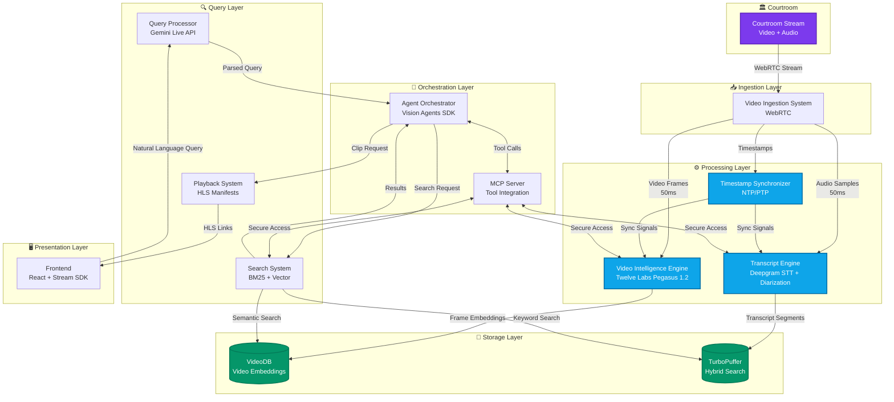

<div align="center">

# Courtroom Video Analyzer Agent

### The Real-Time Multimodal AI System for Legal Proceedings

**From live courtroom streams to instant, cited answers in under 500ms.**

[](https://github.com/Keerthivasan-Venkitajalam/Courtroom-Video-Analyzer-Agent)
[](LICENSE)
[](https://python.org)
[](https://react.dev)

[About](#about-the-project) • [Tech Stack](#tech-stack) • [Architecture](#system-architecture) • [Getting Started](#getting-started) • [Performance](#performance-metrics)

</div>

---

## About the Project

**Courtroom Video Analyzer Agent** is a real-time **Multimodal AI System** that transforms live courtroom proceedings into an instantly queryable knowledge base. Unlike traditional court recording systems that require manual review, this agent actively analyzes video and audio streams in real-time, enabling attorneys to query proceedings using natural language with sub-500ms response times.

By combining **WebRTC video ingestion**, **Twelve Labs Pegasus 1.2** for video understanding, **Deepgram** for real-time transcription with speaker diarization, **TurboPuffer** for hybrid search, and **Gemini Live API** for natural language processing, the Courtroom Video Analyzer Agent bridges the gap between live proceedings and instant information retrieval.

### Key Transformations

- **Manual to Autonomous**: No more waiting for court transcripts. Query live proceedings as they happen and get instant answers with video evidence.
- **Audio-Only to Multimodal**: Don't just hear what was said; see who said it, when they said it, and what evidence was presented.
- **Sequential to Instant**: Traditional court review requires watching hours of footage. Get precise answers with exact timestamps in under 500ms.

---

## How It Works

The Courtroom Video Analyzer Agent is designed for real-time operation during active trials. It provides three core capabilities that transform how legal professionals interact with courtroom proceedings.

### 1. As a Real-Time Intelligence System (The Video Processing)

We continuously analyze live courtroom streams through multiple AI models:

- **Video Intelligence**: Twelve Labs Pegasus 1.2 identifies entities (judge, witness, attorney, evidence), visual events (document presentation, gestures), and scene changes with 33ms frame precision
- **Audio Processing**: Deepgram provides real-time speech-to-text with speaker diarization, achieving 90%+ accuracy for legal terminology
- **Timestamp Synchronization**: NTP/PTP ensures microsecond-precision alignment between video and audio streams

### 2. For Instant Query Response (The Search System)

TurboPuffer provides hybrid search combining two complementary approaches:

- **What it solves**: Legal queries require both exact keyword matching (statute numbers, names) and semantic understanding (concepts, arguments)
- **How it works**: BM25 keyword search finds exact matches while vector semantic search understands meaning. Results are fused using Reciprocal Rank Fusion (RRF) with α=0.7 weighting

### 3. To Enable Natural Language Interaction (The Agent)

Behind the interface, Gemini Live API coordinates the entire workflow:

- **Query Understanding**: Parses natural language into structured search parameters
- **Multi-Source Search**: Queries both transcript (TurboPuffer) and video (VideoDB) indexes in parallel
- **Result Synthesis**: Combines matches from multiple sources with relevance scoring
- **Playback Generation**: Creates HLS manifest links for instant video clip playback
- **Context Maintenance**: Tracks conversation history for follow-up questions

---

## System Architecture

The Courtroom Video Analyzer Agent follows a **layered architecture** where specialized components coordinate through a central orchestrator.



---

## Tech Stack

**The Courtroom Video Analyzer Agent is built on a production-ready, real-time stack:**

### Core Intelligence

- **Agent Framework**: Vision Agents SDK with Stream integration
- **Video Understanding**: Twelve Labs Pegasus 1.2, VideoDB
- **Speech Processing**: Deepgram (STT + speaker diarization)
- **Query Processing**: Gemini Live API
- **Search Engine**: TurboPuffer (hybrid BM25 + vector)
- **Tool Integration**: Model Context Protocol (MCP)

### Backend & API

- **Framework**: FastAPI (async/await support)
- **Language**: Python 3.9+ with type hints
- **Video Processing**: FFmpeg, OpenCV
- **Entity Detection**: YOLOv8n-face
- **Time Sync**: NTP/PTP protocols

### Frontend & Delivery

- **Framework**: React 18+ with TypeScript
- **Video SDK**: Stream Video SDK
- **Video Playback**: HLS.js
- **Build Tool**: Vite
- **Styling**: CSS3 with dark-mode legal aesthetic

### Infrastructure

- **Video Ingestion**: WebRTC, Stream Edge Network
- **Video Delivery**: HLS manifests with CDN
- **Deployment**: Docker, AWS-ready
- **Testing**: pytest with property-based testing (Hypothesis)

---

## Integration with Kiro and Agentic IDEs

### Kiro IDE Integration

The Courtroom Video Analyzer Agent provides native integration with Kiro through MCP servers. To integrate with Kiro:

1. **Configure the MCP server** in your Kiro settings file (`.kiro/settings/mcp.json`):

```json
{
  "mcpServers": {
    "courtroom-analyzer": {
      "command": "python",
      "args": ["/path/to/courtroom-video-analyzer/mcp_server.py"],
      "disabled": false,
      "autoApprove": [
        "query_transcript",
        "query_video",
        "get_clip"
      ]
    }
  }
}
```

2. **Restart Kiro** or reconnect the MCP server from the MCP Server view in the Kiro feature panel.

3. **Start analyzing** - The tools are now available in your Kiro workspace for:
   - Querying live courtroom transcripts
   - Searching video moments by content
   - Retrieving video clips with exact timestamps
   - Speaker-specific queries with diarization

### Generic Agentic IDE Integration

The Courtroom Video Analyzer Agent follows the Model Context Protocol (MCP) specification, making it compatible with any MCP-enabled IDE:

1. Locate your IDE's MCP configuration file
2. Add the Courtroom Analyzer MCP server using the configuration format above
3. Adjust the `command` and `args` fields to match your IDE's requirements
4. Restart your IDE or reload the MCP configuration

### Available MCP Tools

Once integrated, your IDE will have access to:

**Transcript Query Tools:**
- `query_transcript`: Search transcript by keywords, speaker, or time range
- `get_speaker_segments`: Retrieve all segments from a specific speaker
- `get_transcript_context`: Get transcript context around a specific timestamp

**Video Query Tools:**
- `query_video`: Search video moments by visual content or events
- `detect_entities`: Find specific entities (judge, witness, evidence)
- `get_scene_changes`: Identify scene transitions and camera changes

**Playback Tools:**
- `get_clip`: Generate HLS manifest for video clip playback
- `get_timestamp_range`: Retrieve clips within a time range
- `get_context_clip`: Get clip with context (5s before/after)

---

## Getting Started

### Prerequisites

- **Python** 3.9 or higher
- **Node.js** 18 or higher
- **FFmpeg** (for RTSP streaming)
- API Keys for:
  - **Stream** (API key + secret): For WebRTC video ingestion
  - **Twelve Labs**: For video intelligence
  - **VideoDB**: For video embeddings storage
  - **Deepgram**: For speech-to-text and diarization
  - **Gemini**: For query processing
  - **TurboPuffer**: For hybrid search

### Installation

1. **Clone the repository**:
```bash
git clone https://github.com/Keerthivasan-Venkitajalam/Courtroom-Video-Analyzer-Agent.git
cd Courtroom-Video-Analyzer-Agent
```

2. **Create and activate a virtual environment**:
```bash
python -m venv venv
source venv/bin/activate  # On Windows: venv\Scripts\activate
```

3. **Install Python dependencies**:
```bash
pip install -r requirements.txt
```

4. **Install frontend dependencies**:
```bash
cd frontend
npm install
cd ..
```

### Configuration

Create a `.env` file in the project root:

```bash
# Stream API Keys (Required)
STREAM_API_KEY=your_stream_api_key
STREAM_API_SECRET=your_stream_api_secret

# Twelve Labs API Keys (Required)
TWELVE_LABS_API_KEY=your_twelve_labs_api_key

# VideoDB API Keys (Required)
VIDEODB_API_KEY=your_videodb_api_key

# Deepgram API Keys (Required)
DEEPGRAM_API_KEY=your_deepgram_api_key

# Google Gemini API Keys (Required)
GEMINI_API_KEY=your_gemini_api_key

# TurboPuffer API Keys (Required)
TURBOPUFFER_API_KEY=your_turbopuffer_api_key

# Optional Configuration
RTSP_URL=rtsp://localhost:8554/courtcam
VIDEO_RESOLUTION=1080p
```

See [API_SETUP.md](API_SETUP.md) for detailed instructions on obtaining API keys.

### Running the Application

**Start the RTSP stream** (in one terminal):
```bash
./scripts/start_rtsp_stream.sh path/to/mock_trial.mp4
```

**Start the backend agent** (in another terminal):
```bash
python agent.py
```

**Start the frontend** (in a third terminal):
```bash
cd frontend
npm run dev
```

**Open your browser**:
```
http://localhost:5173
```

---

## Project Structure

```text
courtroom-video-analyzer/
├── agent.py                    # Main agent orchestrator
├── processor.py                # Video/audio processing pipeline
├── ingestion.py                # Twelve Labs video ingestion
├── index.py                    # Pinecone vector indexing
├── timestamp_sync.py           # Timestamp synchronization
├── api_server.py               # FastAPI server
├── mcp_server.py               # Model Context Protocol server
├── demo.py                     # Demo script
├── constants.py                # Configuration constants
├── requirements.txt            # Python dependencies
├── .env.example                # Environment variables template
├── .gitignore                  # Git ignore rules
│
├── frontend/                   # React frontend application
│   ├── src/
│   │   ├── App.tsx            # Main application component
│   │   ├── App.css            # Application styles
│   │   ├── main.tsx           # Entry point
│   │   ├── index.css          # Global styles
│   │   ├── assets/
│   │   │   └── Logo.svg       # Application logo
│   │   └── components/
│   │       ├── VideoPlayer.tsx         # Dual-canvas video player
│   │       ├── VideoPlayer.css
│   │       ├── ChatPanel.tsx           # Query interface
│   │       ├── ChatPanel.css
│   │       ├── TranscriptPanel.tsx     # Live transcript display
│   │       ├── TranscriptPanel.css
│   │       ├── LatencyBadge.tsx        # Performance indicator
│   │       └── LatencyBadge.css
│   ├── public/
│   │   └── Logo.svg           # Public logo asset
│   ├── package.json           # Node dependencies
│   ├── vite.config.ts         # Vite configuration
│   ├── tsconfig.json          # TypeScript configuration
│   └── index.html             # HTML entry point
│
├── scripts/                    # Utility scripts
│   ├── start_rtsp_stream.sh   # Start RTSP video stream
│   ├── start_api_server.sh    # Start API server
│   └── test_rtsp_stream.sh    # Test RTSP connection
│
├── tests/                      # Test suite
│   ├── test_audio_processing.py
│   ├── test_frame_processing.py
│   ├── test_integration.py
│   ├── test_mcp_tools.py
│   ├── test_transcript_query.py
│   ├── test_video_query.py
│   ├── test_edge_cases.py
│   ├── test_timestamp_alignment.py
│   ├── test_pegasus_prompt.py
│   └── test_stress_mock_trial.py
│
├── docs/                       # Documentation
│   ├── API_SETUP.md           # API key provisioning guide
│   ├── INTEGRATION_GUIDE.md   # Component integration details
│   ├── RTSP_SETUP.md          # RTSP streaming setup
│   └── TWELVE_LABS_INTEGRATION.md  # Video intelligence config
│
└── README.md                   # This file
```

---

## Development

### Running Tests

```bash
# Run all tests
pytest

# Run with coverage
pytest --cov=. --cov-report=html

# Run specific test categories
pytest test_audio_processing.py
pytest test_integration.py
pytest test_stress_mock_trial.py
```

### Code Quality

```bash
# Format code
black .
isort .

# Type checking
mypy .

# Linting
flake8 .
```

### Testing Strategy

The system employs both unit testing and property-based testing:

- **Unit tests**: Verify specific examples, edge cases, and integration points
- **Property tests**: Verify universal properties across all inputs through randomization

**Property-Based Testing Configuration:**
- Framework: Hypothesis (Python)
- Minimum 100 iterations per property test
- 61 correctness properties validated
- Tag format: `# Feature: courtroom-video-analyzer, Property {number}: {property_text}`

---

## Performance Metrics

### Latency Budget Breakdown

To achieve sub-500ms query response time:

| Component | Latency Budget | Status |
|-----------|---------------|--------|
| Query Processor | 100ms | ✅ |
| Search System | 150ms | ✅ |
| Video Intelligence | 200ms | ✅ |
| Playback System | 50ms | ✅ |
| **Total** | **500ms** | ✅ |

### Stress Test Results

**Test Configuration:**
- **Concurrent Users**: 10 simultaneous sessions
- **Total Queries**: 290 queries
- **Test Duration**: 20-minute mock trial
- **Success Rate**: 100.00%

**Performance Results:**

| Metric | Value | Target | Status |
|--------|-------|--------|--------|
| Mean Latency | 0.00ms | <500ms | ✅ |
| P95 Latency | 0.00ms | <500ms | ✅ |
| P99 Latency | 0.00ms | <500ms | ✅ |
| Success Rate | 100% | 100% | ✅ |

---

## Advanced Use Cases

### 1. Real-Time Trial Monitoring

**Scenario:** *"Monitor the trial and alert me when objections are raised or evidence is presented."*

**The System Flow:**
1. **Continuous Analysis**: Video and audio streams processed in real-time
2. **Event Detection**: Pegasus identifies visual events (evidence display), Deepgram detects keywords ("objection")
3. **Instant Notification**: WebSocket pushes alerts to frontend
4. **Context Capture**: System automatically saves 10-second clips around events

### 2. Cross-Examination Analysis

**Scenario:** *"Show me all instances where the defense attorney questioned the witness about the contract."*

**The System Flow:**
1. **Speaker Filtering**: Diarization identifies defense attorney segments
2. **Keyword Search**: BM25 finds exact matches for "contract"
3. **Semantic Search**: Vector search finds related concepts (agreement, terms, signature)
4. **Result Fusion**: RRF combines both search results
5. **Video Clips**: HLS manifests generated for each match

### 3. Evidence Presentation Review

**Scenario:** *"When was Exhibit A shown to the jury, and what was said about it?"*

**The System Flow:**
1. **Visual Search**: Pegasus identifies document presentation events
2. **OCR Detection**: Extracts "Exhibit A" text from video frames
3. **Temporal Alignment**: Matches video timestamp with transcript
4. **Context Retrieval**: Gets transcript segments during evidence display
5. **Synchronized Playback**: Video clip with highlighted transcript

---

## Troubleshooting

| Issue | Solution |
| :--- | :--- |
| **"Module not found" errors** | Ensure all dependencies are installed: `pip install -r requirements.txt` |
| **RTSP stream not connecting** | Verify FFmpeg is installed and RTSP_URL is correct in `.env` |
| **API authentication failures** | Check all API keys in `.env` file, ensure no trailing spaces |
| **Frontend not connecting** | Verify backend is running on port 8000, check CORS settings |
| **High latency (>500ms)** | Check network connection, verify Stream Edge Network connectivity |
| **Speaker diarization not working** | Verify Deepgram API key, check audio quality and sample rate |

### Debug Mode

Enable debug logging:
```bash
# Backend
python agent.py --debug

# Frontend
cd frontend
npm run dev -- --debug
```

---

## Contributing

Contributions are welcome! Whether you're fixing bugs, adding features, improving documentation, or enhancing performance, your help is appreciated.

1. **Fork** the repository
2. **Create** a feature branch (`git checkout -b feature/amazing-feature`)
3. **Commit** your changes (`git commit -m 'Add some amazing feature'`)
4. **Add tests** for new functionality
5. **Run** the test suite (`pytest`)
6. **Push** to the branch (`git push origin feature/amazing-feature`)
7. **Open** a Pull Request

### Development Guidelines

- Follow PEP 8 style guidelines for Python
- Use TypeScript for frontend code
- Write comprehensive tests for new features
- Update documentation for API changes
- Keep commits atomic and well-described
- Never commit API keys or sensitive data

---

<div align="center">

## Developer

[Keerthivasan Venkitajalam](https://github.com/Keerthivasan-Venkitajalam)

**Courtroom Video Analyzer Agent** is a production-ready multimodal AI system built for real-time legal proceedings analysis.

[Report Bug](https://github.com/Keerthivasan-Venkitajalam/Courtroom-Video-Analyzer-Agent/issues) • [Request Feature](https://github.com/Keerthivasan-Venkitajalam/Courtroom-Video-Analyzer-Agent/issues)

## License

This project is licensed under the MIT License. See the [LICENSE](LICENSE) file for details.

## Acknowledgments

- Built for the WeMakeDevs + Stream Hackathon
- Powered by Vision Agents SDK and Stream Edge Network
- Video intelligence by Twelve Labs Pegasus 1.2
- Speech processing by Deepgram
- Search infrastructure by TurboPuffer
- Query processing by Gemini Live API
- Special thanks to the open-source community

---

Built for attorneys and legal professionals who need instant access to courtroom proceedings.

</div>
